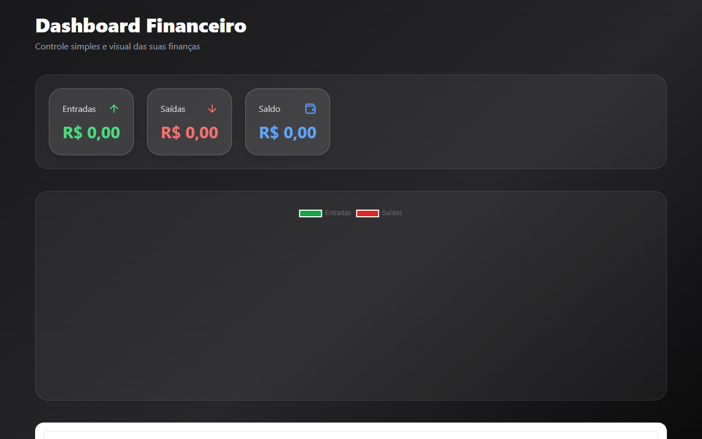

# 💰 Dashboard Financeiro React

[](https://vercel.com/douglas-melos-projects-333a667f/finance-dashboard-react)


---

## 🖥️ Visão Geral

Este é um **Dashboard Financeiro** desenvolvido com **React**, **Vite** e **Tailwind CSS**.  
Ele permite gerenciar suas finanças de forma simples:

✔ Adicionar transações (entrada e saída)  
✔ Editar e remover itens  
✔ Calcular totais de entradas, saídas e saldo  
✔ Visualizar dados em gráfico de pizza  
✔ Filtrar transações por tipo  
✔ Persistência no navegador (localStorage)  

---

## 📸 Screenshot



> Captura de tela gerada automaticamente usando Puppeteer.

---

## 🚀 Tecnologias

Este projeto foi construído com:

- **React** — Biblioteca para construção de interfaces  
- **Vite** — Bundler rápido e moderno  
- **Tailwind CSS** — Framework utilitário de estilos  
- **Chart.js + React Chart.js 2** — Criação de gráficos  
- **Lucide React** — Coleção de ícones  
- **Puppeteer** (dev) — Para criar screenshots automáticas

---

## ⚡ Deploy Online

A versão em produção está disponível em:

👉 https://vercel.com/douglas-melos-projects-333a667f/finance-dashboard-react

Use esse link para compartilhar seu projeto com qualquer pessoa!

---

## 📦 Como rodar localmente

Siga estes passos:

### 1) Clone o repositório
```bash
git clone https://github.com/Douglas-dMelo/finance-dashboard-react.git
cd finance-dashboard-react

